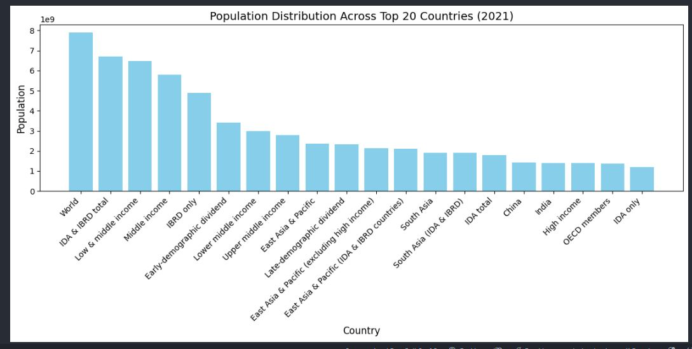
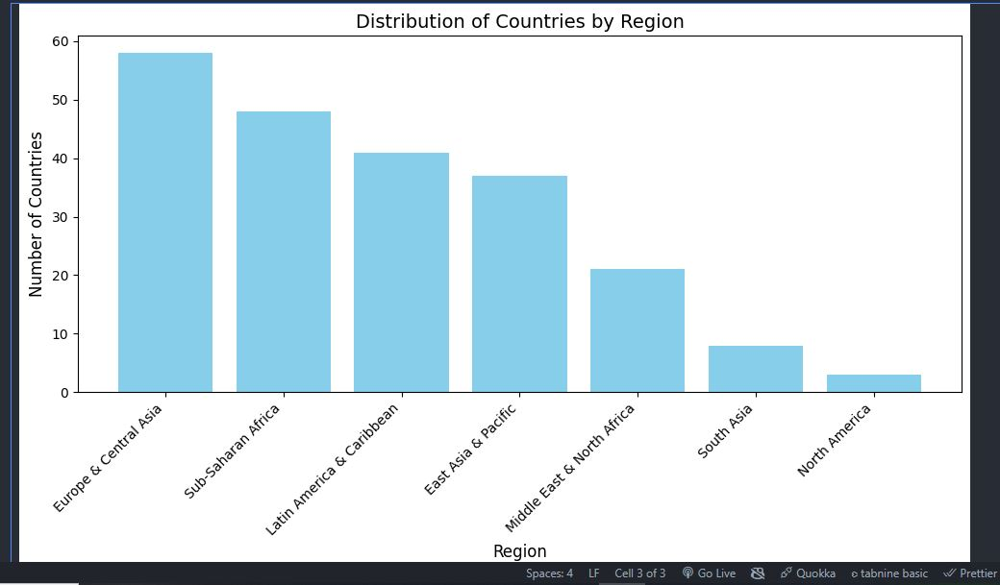

# Distribution Visualization Project

## Project Overview
This project focuses on analyzing and visualizing global population distribution and the distribution of countries by region using bar charts. The analysis leverages the **World Bank Population Dataset** to provide insights into global demographics and country classifications.

---

## Objectives
1. Visualize the **population distribution** across the top 20 countries in 2021.
2. Analyze the **distribution of countries by region** globally.

---

## Dataset
- **Source:** [World Bank Population Data](https://data.worldbank.org/indicator/SP.POP.TOTL)
- **File Used:**
  - `API_SP.POP.TOTL_DS2_en_csv_v2_56.csv` (Population Data)
  - `Metadata_Country_API_SP.POP.TOTL_DS2_en_csv_v2_56.csv` (Metadata)

---

## Methodology
### 1. **Population Distribution (2021)**
- Filtered the dataset to select population data for 2021.
- Sorted the data to identify the top 20 most populous countries.
- Created a **bar chart** to depict the population distribution using `matplotlib`.

### 2. **Distribution of Countries by Region**
- Extracted and cleaned metadata for `Region` and `IncomeGroup`.
- Counted the number of countries in each region.
- Created a **bar chart** to visualize country distribution by region.

---

## Key Techniques
- **Data Cleaning:** Used `pandas` to filter, sort, and clean missing values.
- **Visualization:** Created bar charts using `matplotlib`.
- **Analysis:** Highlighted key demographic trends and regional distributions.

---

## Insights
### Population Distribution
- The visualization shows significant disparities in global population, with **China**, **India**, and the **United States** dominating the numbers.

### Regional Distribution
- The highest number of countries are in **Europe & Central Asia**, followed by **Sub-Saharan Africa** and **Latin America & the Caribbean**.

---

## Visual Outputs
### 1. Population Distribution Across Top 20 Countries (2021)


### 2. Distribution of Countries by Region


---

## How to Run the Code
1. **Install Required Libraries:**
   ```bash
   pip install pandas matplotlib
